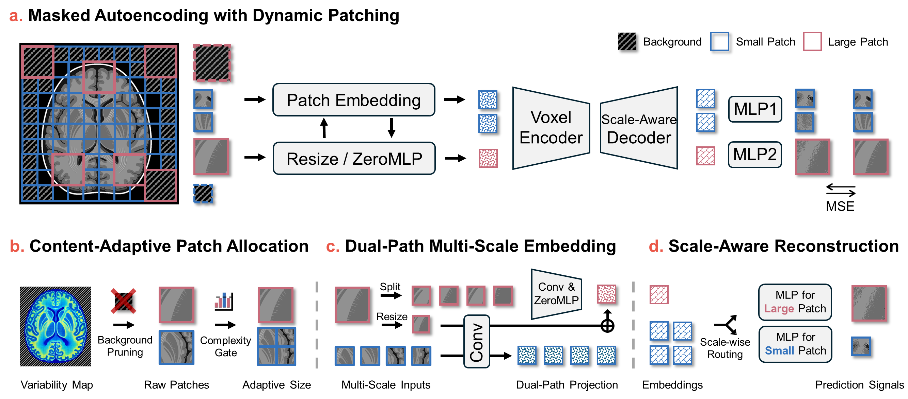

<div align="center">

# Omni-fMRI: A Universal Atlas-Free fMRI Foundation Model

<div align="center">
  
[](https://arxiv.org/xx)
[]([https://github.com/xx](https://github.com/OneMore1/Omni-fMRI))
[]([https://huggingface.co/xx](https://huggingface.co/OneMore1/Omni-fMRI))
[](https://hub.docker.com/r/xx)

</div>

This repository contains the official implementation of Omni-fMRI: A Universal Atlas-Free fMRI Foundation Model, which introduces a dynamic patching mechanism that significantly reduces computational costs while preserving informative spatial structures.

<p align="center">
  
</p>

</div>

## Installation

Setting up the environment requires Python 3.10 and CUDA-compatible PyTorch for GPU acceleration:

```
conda create -n omnifmri python=3.11

pip install torch==2.4.1 torchvision==0.19.1 torchaudio==2.4.1 --index-url https://download.pytorch.org/whl/cu124

pip install -r requirements.txt
```


## Project Structure

The codebase is organized into modular components for easy navigation and extension:

```
├── configs/                # Configuration files
│   ├── finetune.yaml       # Configuration for the fine-tuning phase
│   └── pretrain.yaml       # Configuration for the pre-training phase
├── scripts/                # Shell scripts for automated execution
│   ├── finetune.sh         
│   └── pretrain.sh         
├── src/                    # Source code core
│   ├── data/               # Data loadind
│   ├── models/             # Models Architecture 
│   └── utils/              # Helper functions (Logging, metrics, checkpoints)
├── finetune.py             # Main entry point for model fine-tuning
├── heatmap_visualize.py    # Visualization tool for generating heatmaps
├── pretrain.py             # Main entry point for model pre-training
└── visual_3d.py            # Visualization tool
```

## Data Preparation

### Preprocessing Pipeline

fMRI data were resampled with cubic spline interpolation to a $96\times96\times96$ grid at 2 mm isotropic resolution in MNI space. Time series with TR outside 0.7–0.8 s were voxel-wise resampled to 0.72 s with cubic splines, and signals were globally z-scored within the brain mask. We followed the preprocessing settings in [Swift](https://github.com/Transconnectome/SwiFT).

## Training

### Pre-training

1. Ensure your pre-train data structure as follow:

```
data_root/
├── ABIDE_train/                
├── ABIDE_val/                  
├── HCP_val/              
└── HCP_train/              
    ├── 0010001/                # Subject ID
    └── 0010002/                
        ├── 0010002_run-1_0000-0199_1.npz  # Data chunk 1 
        ├── 0010002_run-1_0000-0199_2.npz  # Data chunk 2
```

2. Edit `configs/pretrain.yaml` and update the `data_root` and `datasets`

```yaml
data:
  data_root: /path/to/data_root
  datasets: ["HCP", "ABIDE"]
```

3. Start pre-training from unlabeled fMRI data using multi-scale masked prediction tasks:

```bash
# running pretrain
sh scripts/pretrain.sh
```

### Downstream evaluation

We have provided serval downstream dataloader as follow:

1. Loading downstream datasets as pre-training data structure:

```yaml
task:
  csv: "/path/to/data_csv"

data:
  data_root: /path/to/data_root
  datasets: ["HCP"]
  mode: "directory"
```

2. Loading dowwnstream datasets with txt:

```yaml
task:
  csv: "/path/to/data_csv"

data:
  train_txt: /path/to/train_txt
  val_txt: /path/to/val_txt
  test_txt: /path/to/test_txt
  mode: "txt"
```

3. Loading downstream datasets with txt and directory mapping:

```yaml
data:
  train_txt: /path/to/train_txt
  val_txt: /path/to/val_txt
  test_txt: /path/to/test_txt
  mode: "txt_mapping"
```

Start downstream training:

```bash
# running downstream training
sh scripts/finetune.sh
```

#### Model Checkpoints

Our pre-trained model weights can be found in Huggingface.

#### Model Docker

Docker can be found in Dockerhub.

#### Citation
Discussions are welcome. The paper **Omni-fMRI** is available in the repository (link coming soon). 


